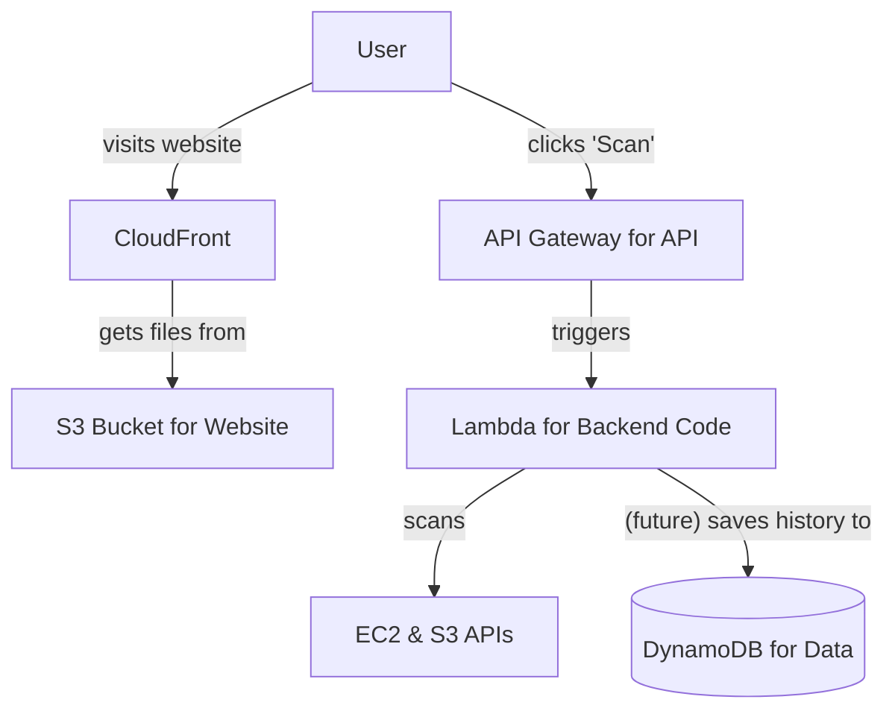

# A Simple Guide to Deploying the CSPM App on AWS

This guide explains how we would put our application on the internet for real-world use, using a modern and cost-effective approach called "serverless". This guide is for beginners, so we'll use simple terms and analogies.

### The Plan in a Picture (The Architecture)

This diagram shows how all the pieces fit together on AWS.



### Alternative ASCII Diagram

```
+----------------+      +-------------------------+      +---------------------+
|      User      |----->| Amazon CloudFront (CDN) |----->| S3 Bucket (Website) |
+----------------+      +-------------------------+      +---------------------+
       |
       | API Call
       v
+-------------------------+      +-------------------------+      +---------------------+
| Amazon API Gateway (API)|----->|   AWS Lambda Function   |----->|     EC2 & S3 APIs   |
+-------------------------+      +-------------------------+      +---------------------+
                                            | (future)
                                            v
                                     +----------------------+
                                     | Amazon DynamoDB(Data)|
                                     +----------------------+
```
---

### Part 1: Deploying the Frontend (The Visual Part)

Our frontend is a React application. It's just a set of HTML, CSS, and JavaScript files.

-   **What We Use**: **Amazon S3** + **Amazon CloudFront**.
-   **Analogy**:
    -   **S3** is like a **bookshelf** where you put your website files. It's simple and cheap storage.
    -   **CloudFront** is like a global network of **super-fast librarians**. They make copies of your website from the bookshelf and keep them in libraries all over the world. When a user wants to see your site, the nearest librarian gives it to them instantly.
-   **Why We Chose This**:
    -   **It's Fast**: Users get the website from a location near them, so it loads very quickly.
    -   **It's Cheap**: This is the most cost-effective way to host a website.
    -   **It's Tough**: It can handle millions of visitors without ever crashing.

---

### Part 2: Deploying the Backend (The "Thinking" Part)

Our backend is a Python API that does the actual work of scanning AWS.

-   **What We Use**: **AWS Lambda** + **Amazon API Gateway**.
-   **Analogy**:
    -   A traditional server (like **ECS Fargate**) is like **leaving a light on 24/7**. You pay for the electricity whether you're in the room or not.
    -   **Lambda** is like a **motion-activated light**. It only turns on and uses power for the few seconds you're in the room (when a user makes a scan request).
-   **Why We Chose This**:
    -   **It's Extremely Cheap**: Since our app is only used on-demand, we only pay for the few seconds it takes to run a scan. When nobody is using it, the cost is zero.
    -   **No Management**: We don't have to worry about the server; AWS does it all.
    -   **API Gateway** acts as the secure and reliable front door for our Lambda function, giving it a clean URL.

---

### Part 3: A Database for the Future (The "Memory" Part)

Right now, our app doesn't save any data. But if we wanted to add a history of past scans, we would need a database.

-   **What We Would Use**: **Amazon DynamoDB**.
-   **Analogy**:
    -   A traditional database (like **Amazon RDS**) is like buying a **physical filing cabinet**. You have a fixed amount of space, and it can get full.
    -   **DynamoDB** is like a **magical, cloud-based filing cabinet** that instantly grows as large as you need it to be.
-   **Why We Would Choose This**:
    -   **It's Also Serverless**: It fits our pay-for-what-you-use model perfectly.
    -   **It's Flexible**: It's a NoSQL database, which means it's very easy to store different kinds of data without a rigid structure.
    -   **It's Fast and Scalable**: It's designed for modern applications and can handle huge amounts of data.

By using this serverless strategy, we get a professional, production-ready application that is fast, secure, scalable, and incredibly cheap to run.